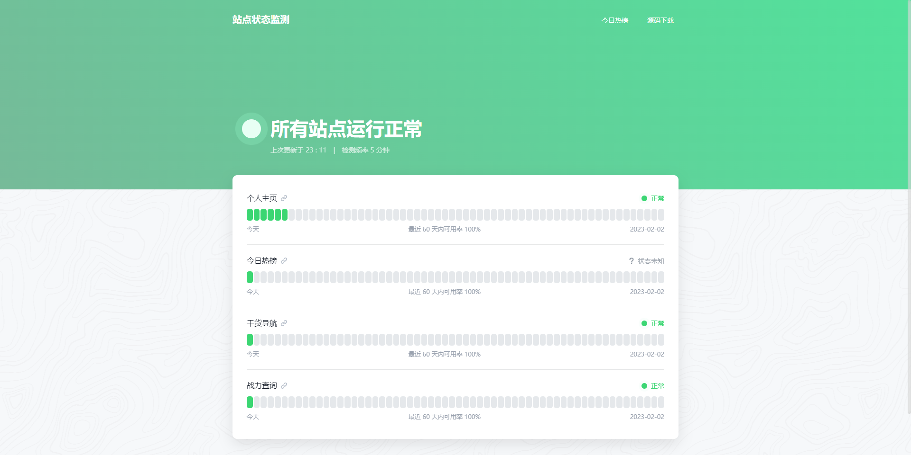

## 项目介绍
一个基于 UptimeRobot API 实时监控主机、网站、端口等在线监控，可以直接部署，快速上线，纯静态无需服务器（基于Vercel也是超级棒的）。修改自 [uptime-status](https://github.com/yb/uptime-status) 

## 在线体验： 
美化版：<https://status.sapi.run>  



## 修改内容

- 切换API
- 修改部分样式
- 新增站点状态总览
- 新增数据获取失败提示
- 移动端适配


## 如何使用

- 下载本项目
- 修改 `config.js` 文件：
   1. `SiteName`: 要显示的网站名称
   2. `ApiKeys`: 从 UptimeRobot 获取的 API Key，支持 Monitor-Specific API Keys 和 Read-Only API Key。**强烈建议使用 Read-Only API  key**
   3. `CountDays`: 要显示的日志天数，建议 60 或 90，显示效果比较好
   4. `ShowLink`: 是否显示站点链接
   5. `Navi`: 导航栏的菜单列表
- 将所有文件上传到网站空间


## 本地调试
```
# 安装依赖
npm i --unsafe-perm=true
# 运行
npm run start
#打包
npm run build
```

## 说明
本项目是来自原作的简化版：https://github.com/yb/uptime-status

本项目来自美化版：https://github.com/imsyy/status 